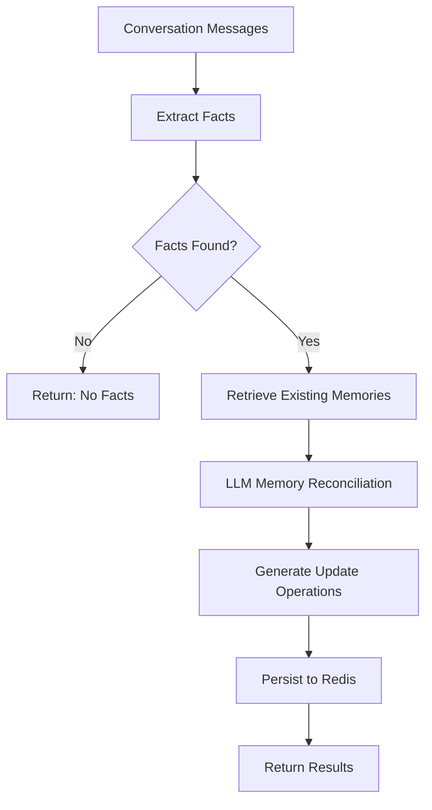

# RecallKit Memory Management System

This module provides intelligent memory management for the RecallKit dashboard, allowing the system to extract, store, and manage user memories from conversations.

## Architecture Overview

The memory management system consists of three main components:

### 1. **manager.ts** - Core Processing Logic

The main orchestrator that handles the complete memory processing workflow:

- **Fact Extraction**: Uses LLM to extract meaningful facts from conversations
- **Memory Reconciliation**: Compares new facts with existing memories to determine required operations
- **Persistence**: Stores memory changes to Redis with semantic embeddings

### 2. **prompts.ts** - LLM Prompts

Contains specialized prompts for:

- Extracting facts from conversations
- Determining memory update operations (ADD, UPDATE, DELETE, NONE)

### 3. **types.ts** - Type Definitions

Provides comprehensive TypeScript types for:

- Message structures
- Memory operations
- Processing results
- Event interfaces

## Key Features

### ✨ **Intelligent Memory Processing**

- Extracts relevant facts from multi-message conversations
- Reconciles new information with existing memories
- Supports four operations: ADD, UPDATE, DELETE, NONE

### 🔍 **Semantic Search Ready**

- Generates embeddings for all memories using OpenAI
- Stores embeddings alongside memory text for future semantic search

### 🚀 **Scalable Architecture**

- Uses Redis for high-performance storage
- Implements efficient batch operations
- Structured for horizontal scaling

### 🛡️ **Type Safety**

- Full TypeScript coverage
- Runtime validation with Zod schemas
- Comprehensive error handling

### 📊 **Observability**

- Detailed logging for each processing step
- Operation metrics and success/failure tracking
- Structured result reporting

## Processing Workflow



## Usage Example

```typescript
import { processMemory } from "./manager";

// Trigger memory processing via Inngest
await inngest.send({
  name: "memory/process",
  data: {
    messages: [
      { role: "user", content: "Hi, my name is John and I love pizza." },
      {
        role: "assistant",
        content: "Nice to meet you John! What kind of pizza do you prefer?",
      },
      { role: "user", content: "I really enjoy pepperoni and mushroom pizza." },
    ],
    namespace: "user-workspace",
    userId: "user123",
  },
});
```

## Redis Data Structure

The system uses an efficient Redis structure for storing memories:

```
memories:{namespace}:{userId}:ids → Set of memory IDs
memories:{namespace}:{userId}:{memoryId} → Hash containing:
  - id: Memory identifier
  - text: Memory content
  - embedding: JSON-encoded vector embedding
  - createdAt: ISO timestamp
  - updatedAt: ISO timestamp
```

## Configuration

The system uses the following environment variables:

- `REDIS_HOST` - Redis server host
- `REDIS_PORT` - Redis server port (default: 6379)
- `REDIS_PASSWORD` - Redis authentication password
- `REDIS_USERNAME` - Redis username (default: "default")
- `INNGEST_EVENT_KEY` - Inngest event key for processing
- `OPENAI_API_KEY` - OpenAI API key for LLM and embeddings

## Error Handling

The system implements comprehensive error handling:

- **Validation Errors**: Input validation for messages, namespace, and userId
- **LLM Errors**: Retry logic for fact extraction and memory reconciliation
- **Redis Errors**: Connection management and operation failure handling
- **Embedding Errors**: Fallback strategies for embedding generation failures

## Performance Optimizations

- **Batch Operations**: Uses Redis pipelines for efficient multi-operation execution
- **Parallel Processing**: Concurrent embedding generation and memory retrieval
- **Connection Pooling**: Reuses Redis connections across operations
- **Early Termination**: Exits early when no facts are found

## Monitoring & Debugging

The system provides detailed logging at each step:

- Fact extraction results
- Memory reconciliation decisions
- Persistence operation outcomes
- Performance metrics and timing

All logs are prefixed with `[namespace/userId]` for easy filtering and debugging.
